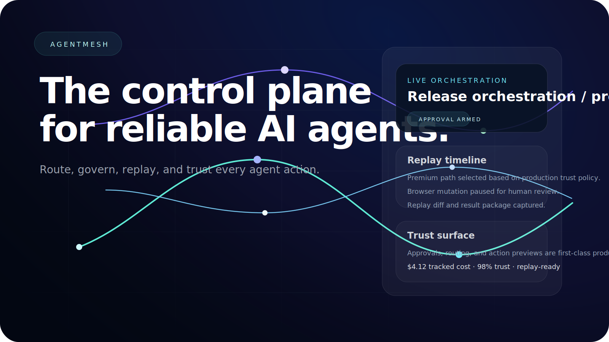

# AgentMesh



AgentMesh is a premium control plane for teams running AI agents.

It turns fragmented agent workflows into something you can actually operate:
- route work across runtimes and providers
- govern sensitive actions with approvals
- replay every run
- inspect trust, cost, and latency
- manage MCP and tool surfaces from one place

## Product thesis

The next premium AI product is not a single agent.
It is the orchestration / control / trust / routing / replay / permissions layer around many agents.

## What this MVP includes

- premium cinematic landing page
- deployable Next.js app
- local-first workspace demo
- task template launchpad
- route-aware execution runs
- approval queue
- replay / branch model
- provider runtime health cards
- MCP/tool catalog
- cost / latency / trust overview
- SVG social preview asset

## Tech

- Next.js 16
- React 19
- Tailwind CSS 4
- Framer Motion
- Vitest

## Local development

From the workspace root:

```bash
pnpm install
pnpm dev
```

Then open:
- http://localhost:3000
- http://localhost:3000/workspace

## Tests

```bash
pnpm test:run
```

## Current MVP note

This version is intentionally local-first and demo-friendly.
The core domain layer is structured to grow into:
- multi-tenant auth
- real provider credentials
- persistent API/backend services
- managed run infrastructure
- usage billing
- enterprise governance

## Workspace paths

Project root:
- `/Volumes/AtlasDrive/Atlas/startups/agentmesh`

Key docs:
- `docs/research/trending-ai-product-opportunities.md`
- `docs/prd.md`
- `.hermes/plans/2026-06-06-agentmesh-master-plan.md`

## Positioning

AgentMesh is designed for:
- AI-native startups
- platform teams
- agent power users
- companies standardizing multi-agent workflows

## Vision

Build the operating system for reliable agent work.
